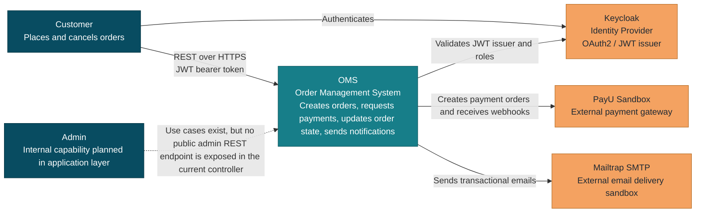
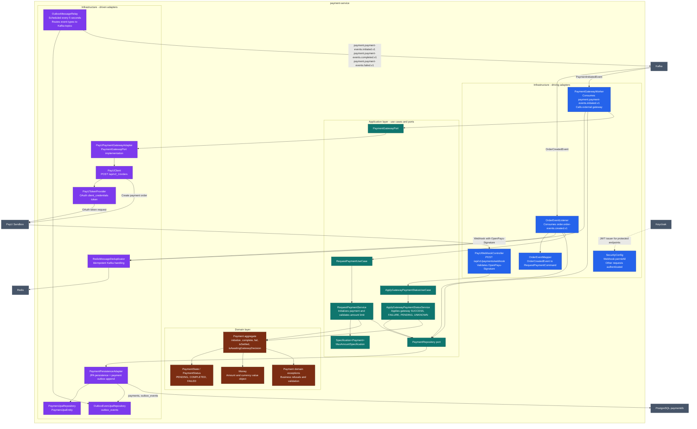
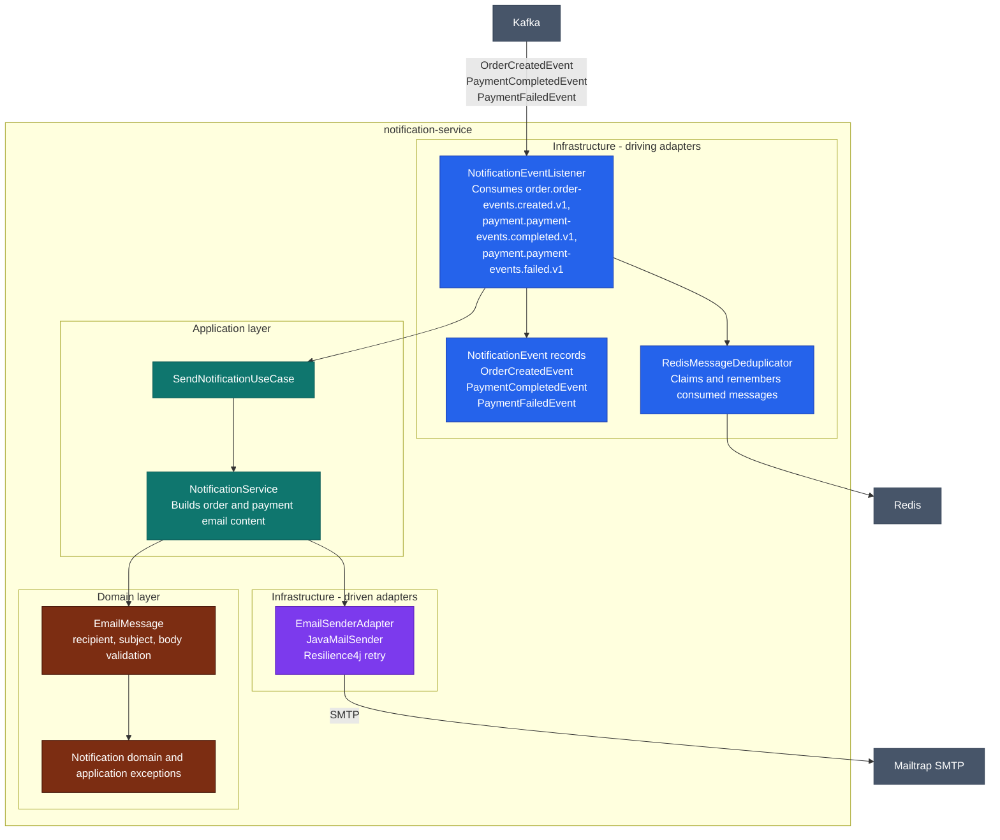
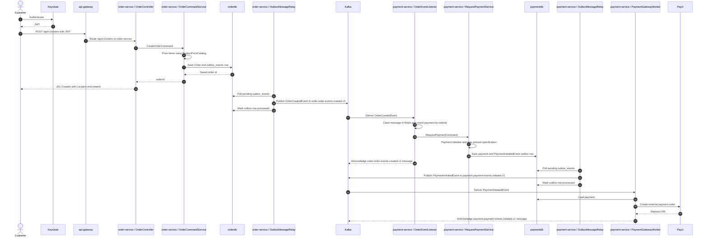
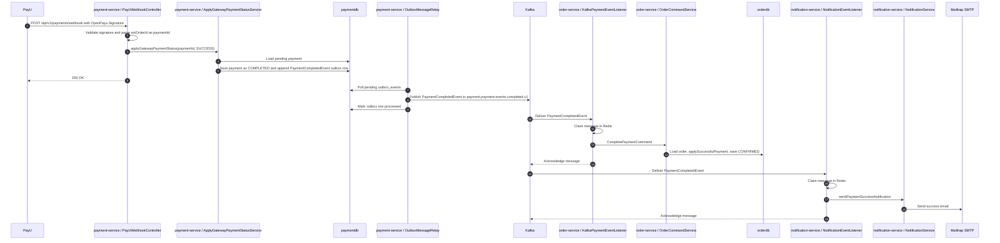
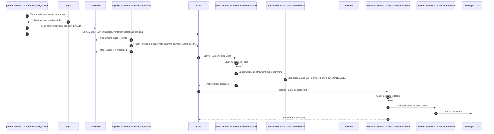
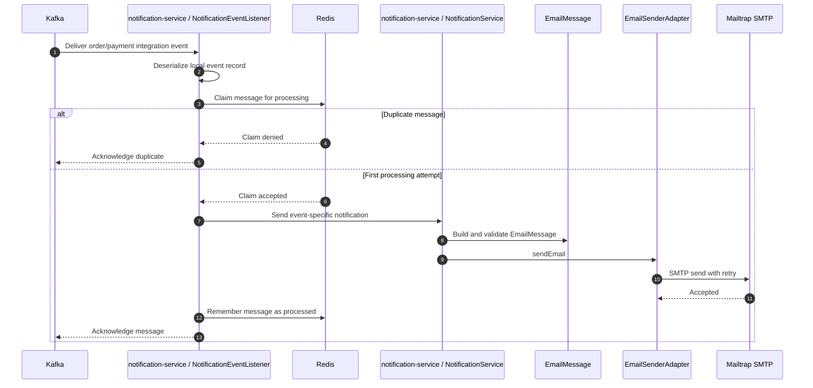

# Detailed C4 Model for OMS

This document describes the current architecture of the Order Management System (OMS) using the C4 model.

## Scope and Notation

The model covers:

- C1: system context
- C2: containers
- C3: key components inside the domain services
- Dynamic views for the main order and payment flows

The system follows a microservice architecture with event-driven choreography and hexagonal architecture inside the business services.

## C1 - System Context

OMS is responsible for accepting customer orders, coordinating payment processing, updating order state after payment outcomes, and sending customer notifications. It delegates authentication to Keycloak, payment execution to PayU, and email delivery to Mailtrap SMTP.

| Element | Type | Responsibility |
| --- | --- | --- |
| Customer | Person | Creates an order and can cancel their own order through the public API. |
| Admin | Person | Application-layer admin cancellation capability exists, but there is no current public admin controller endpoint. |
| OMS | Software system | Owns order lifecycle, payment coordination, and notification orchestration. |
| Keycloak | External system | Issues JWT tokens and stores identity data in its own PostgreSQL database. |
| PayU | External system | Receives payment creation requests and calls the payment webhook with gateway status. |
| Mailtrap SMTP | External system | Receives outgoing notification emails from `notification-service`. |

## C2 - Containers

The system is split into Spring Boot services plus shared infrastructure. Runtime service discovery uses Eureka. Inter-service business communication is asynchronous through Kafka topics.

```mermaid
flowchart TB
    classDef gateway fill:#2563eb,color:#ffffff,stroke:#1e40af,stroke-width:1px
    classDef service fill:#0f766e,color:#ffffff,stroke:#115e59,stroke-width:1px
    classDef infra fill:#475569,color:#ffffff,stroke:#334155,stroke-width:1px
    classDef datastore fill:#7c3aed,color:#ffffff,stroke:#5b21b6,stroke-width:1px
    classDef external fill:#f59e0b,color:#111827,stroke:#b45309,stroke-width:1px
    classDef person fill:#075985,color:#ffffff,stroke:#0c4a6e,stroke-width:1px

    customer["Customer"]:::person
    payu["PayU Sandbox"]:::external
    mailtrap["Mailtrap SMTP"]:::external

    subgraph oms["OMS Runtime"]
        api_gateway["api-gateway<br/>Spring Cloud Gateway<br/>Port 8000"]:::gateway
        discovery["discovery-server<br/>Eureka Server<br/>Port 8761"]:::infra

        order_service["order-service<br/>Spring Boot Web MVC<br/>Hexagonal architecture"]:::service
        payment_service["payment-service<br/>Spring Boot Web MVC<br/>Hexagonal architecture"]:::service
        notification_service["notification-service<br/>Spring Boot consumer + mail sender<br/>Hexagonal architecture"]:::service

        kafka["Kafka<br/>Event broker<br/>Port 9092"]:::infra
        redis["Redis<br/>Message deduplication<br/>Port 6379"]:::infra

        order_db["PostgreSQL orderdb<br/>orders, order_items, outbox_events"]:::datastore
        payment_db["PostgreSQL paymentdb<br/>payments, outbox_events"]:::datastore
        keycloak["Keycloak<br/>OAuth2 / JWT issuer<br/>Port 8081"]:::infra
        keycloak_db["PostgreSQL keycloak-db<br/>Keycloak identity data"]:::datastore
    end

    customer -->|"POST /api/v1/orders<br/>POST /api/v1/orders/{id}/cancel<br/>JWT USER role"| api_gateway
    api_gateway -->|"Route /api/v1/orders/** via lb://order-service"| order_service

    api_gateway -->|"Fetch service instances"| discovery
    order_service -->|"Registers and discovers services"| discovery
    payment_service -->|"Registers and discovers services"| discovery
    notification_service -->|"Registers and discovers services"| discovery

    api_gateway -->|"Validates JWT issuer"| keycloak
    order_service -->|"Validates JWT issuer and USER role"| keycloak
    payment_service -->|"Allows PayU webhook, protects other requests"| keycloak
    keycloak -->|"Persists realms, users, clients"| keycloak_db

    order_service -->|"JPA + Flyway"| order_db
    payment_service -->|"JPA + Flyway"| payment_db

    order_service -->|"Publishes order.order-events.created.v1<br/>Consumes payment.payment-events.completed.v1 and payment.payment-events.failed.v1"| kafka
    payment_service -->|"Consumes order.order-events.created.v1<br/>Publishes payment.payment-events.initiated.v1, payment.payment-events.completed.v1, payment.payment-events.failed.v1"| kafka
    notification_service -->|"Consumes order.order-events.created.v1, payment.payment-events.completed.v1, payment.payment-events.failed.v1"| kafka

    order_service -->|"Consumed message claims and processed markers"| redis
    payment_service -->|"Consumed message claims and processed markers"| redis
    notification_service -->|"Consumed message claims and processed markers"| redis

    payment_service -->|"Create payment order<br/>OAuth token and REST API"| payu
    payu -->|"POST /api/v1/payments/webhook<br/>OpenPayu-Signature"| payment_service

    notification_service -->|"SMTP with retry"| mailtrap
```

### Container Responsibilities

| Container | Technology | Main responsibilities |
| --- | --- | --- |
| `api-gateway` | Spring Cloud Gateway, OAuth2 Resource Server | Public HTTP entrypoint. Routes `/api/v1/orders/**` to `order-service` through Eureka service discovery. |
| `discovery-server` | Spring Cloud Netflix Eureka Server | Runtime registry for gateway and services. |
| `order-service` | Spring Boot, Spring MVC, Spring Security, Spring Kafka, Spring Data JPA, Flyway | Owns order aggregate, order state transitions, order persistence, order outbox, and payment outcome handling. |
| `payment-service` | Spring Boot, Spring MVC, Spring Security, Spring Kafka, Spring Data JPA, Flyway, RestClient | Owns payment aggregate, payment persistence, PayU integration, payment outbox, and gateway status application. |
| `notification-service` | Spring Boot, Spring Kafka, Spring Mail, Resilience4j Retry | Sends email notifications after order and payment events. |
| Kafka | Apache Kafka | Event broker for saga choreography. |
| Redis | Redis | Cross-consumer message deduplication using message claims and processed markers. |
| `orderdb` | PostgreSQL | Stores `orders`, `order_items`, and order `outbox_events`. |
| `paymentdb` | PostgreSQL | Stores `payments` and payment `outbox_events`. |
| Keycloak | Keycloak + PostgreSQL | Identity provider and JWT issuer. |

### Main Kafka Topics

| Topic | Producer | Consumers | Purpose |
| --- | --- | --- | --- |
| `order.order-events.created.v1` | `order-service` outbox relay | `payment-service`, `notification-service` | Announces order creation. |
| `payment.payment-events.initiated.v1` | `payment-service` outbox relay | `PaymentGatewayWorker` inside `payment-service` | Decouples payment persistence from the external PayU call. |
| `payment.payment-events.completed.v1` | `payment-service` outbox relay | `order-service`, `notification-service` | Announces successful payment settlement. |
| `payment.payment-events.failed.v1` | `payment-service` outbox relay | `order-service`, `notification-service` | Announces failed payment settlement. |

## C3 - Order Service Components

`order-service` is implemented as a hexagonal service. Driving adapters are REST and Kafka listeners. Application services implement use cases. The domain model owns business invariants. Driven adapters persist state, publish outbox messages, and provide product pricing.

```mermaid
flowchart TB
    classDef adapterIn fill:#2563eb,color:#ffffff,stroke:#1e40af
    classDef app fill:#0f766e,color:#ffffff,stroke:#115e59
    classDef domain fill:#7c2d12,color:#ffffff,stroke:#431407
    classDef adapterOut fill:#7c3aed,color:#ffffff,stroke:#5b21b6
    classDef external fill:#475569,color:#ffffff,stroke:#334155

    api_gateway["api-gateway"]:::external
    kafka["Kafka"]:::external
    redis["Redis"]:::external
    order_db["PostgreSQL orderdb"]:::external

    subgraph order_service["order-service"]
        subgraph in_adapters["Infrastructure - driving adapters"]
            order_controller["OrderController<br/>POST /api/v1/orders<br/>POST /api/v1/orders/{id}/cancel"]:::adapterIn
            request_mapper["OrderRequestMapper<br/>HTTP DTO to command mapping"]:::adapterIn
            payment_listener["KafkaPaymentEventListener<br/>Consumes payment.payment-events.completed.v1<br/>Consumes payment.payment-events.failed.v1"]:::adapterIn
            security["SecurityConfig<br/>JWT resource server<br/>USER role rules"]:::adapterIn
            error_handler["GlobalExceptionHandler<br/>REST error responses"]:::adapterIn
        end

        subgraph application["Application layer - use cases and ports"]
            create_uc["CreateOrderUseCase"]:::app
            complete_uc["CompletePaymentUseCase"]:::app
            cancel_customer_uc["CancelOrderByCustomerUseCase"]:::app
            cancel_admin_uc["CancelOrderByAdminUseCase"]:::app
            cancel_payment_failure_uc["CancelOrderDueToPaymentFailureUseCase"]:::app
            order_command_service["OrderCommandService<br/>Creates orders<br/>Applies successful payments"]:::app
            order_cancellation_service["OrderCancellationService<br/>Handles customer, admin, and payment-failure cancellations"]:::app
            order_repo_port["OrderRepository port"]:::app
            price_catalog_port["ProductPriceCatalog port"]:::app
        end

        subgraph domain["Domain layer"]
            order_aggregate["Order aggregate<br/>create, applySuccessfulPayment,<br/>cancelByCustomer, cancelByAdmin,<br/>cancelDueToPaymentFailure"]:::domain
            order_state["OrderState / OrderStatus<br/>State transition rules"]:::domain
            order_lines["OrderLines and OrderItem<br/>Line validation and totals"]:::domain
            money["Money<br/>Currency-safe value object"]:::domain
            cancellation_reason["CancellationReason hierarchy<br/>Customer, admin, payment failure"]:::domain
            domain_events["DomainEvent implementations<br/>OrderCreatedDomainEvent<br/>OrderCancellationEvent variants"]:::domain
        end

        subgraph out_adapters["Infrastructure - driven adapters"]
            persistence["OrderPersistenceAdapter<br/>JPA persistence + outbox append"]:::adapterOut
            jpa_repo["OrderJpaRepository<br/>OrderJpaEntity, OrderItemJpaEntity"]:::adapterOut
            outbox_repo["OutboxEventJpaRepository<br/>outbox_events"]:::adapterOut
            event_translator["DomainToIntegrationEventTranslator<br/>Domain events to integration events"]:::adapterOut
            outbox_relay["OutboxMessageRelay<br/>Scheduled every 2 seconds<br/>Publishes pending outbox rows"]:::adapterOut
            price_catalog["InMemoryProductPriceCatalog<br/>Trusted product prices"]:::adapterOut
            deduplicator["RedisMessageDeduplicator<br/>Idempotent Kafka handling"]:::adapterOut
        end
    end

    api_gateway -->|"HTTP + JWT"| order_controller
    order_controller --> request_mapper
    order_controller --> create_uc
    order_controller --> cancel_customer_uc

    kafka -->|"PaymentCompletedEvent<br/>PaymentFailedEvent"| payment_listener
    payment_listener --> deduplicator
    payment_listener --> complete_uc
    payment_listener --> cancel_payment_failure_uc

    create_uc --> order_command_service
    complete_uc --> order_command_service
    cancel_customer_uc --> order_cancellation_service
    cancel_admin_uc --> order_cancellation_service
    cancel_payment_failure_uc --> order_cancellation_service

    order_command_service --> price_catalog_port
    order_command_service --> order_aggregate
    order_command_service --> order_repo_port
    order_cancellation_service --> order_aggregate
    order_cancellation_service --> order_repo_port

    order_aggregate --> order_state
    order_aggregate --> order_lines
    order_aggregate --> money
    order_aggregate --> cancellation_reason
    order_aggregate --> domain_events

    order_repo_port --> persistence
    price_catalog_port --> price_catalog
    persistence --> jpa_repo
    persistence --> outbox_repo
    persistence --> event_translator
    persistence -->|"orders, order_items, outbox_events"| order_db

    outbox_relay --> outbox_repo
    outbox_relay -->|"order.order-events.created.v1 with outbox-event-id header"| kafka
    deduplicator --> redis
```

### Order Service Component Notes

- `OrderController` extracts the customer id from the JWT subject and never trusts a customer id from the request body.
- `OrderCommandService` uses `ProductPriceCatalog` to obtain trusted product prices before creating the domain order.
- `OrderCancellationService` hides another customer's order by throwing `OrderNotFoundException` when a customer tries to cancel an order they do not own.
- `OrderPersistenceAdapter` writes domain changes and outbox rows in the same transactional boundary through the repository port.
- `OutboxMessageRelay` publishes `String` JSON payloads to Kafka and adds `outbox-event-id` and `outbox-event-type` headers.
- `KafkaPaymentEventListener` uses Redis-backed deduplication and treats invalid state transitions as idempotent skips.

## C3 - Payment Service Components

`payment-service` is also hexagonal. It consumes order events, creates payment aggregates, calls PayU asynchronously through an internal Kafka worker, applies webhook decisions, and publishes payment outcome events through its outbox relay.

### Payment Service Component Notes

- `OrderEventListener` rejects malformed JSON by acknowledging the message and skipping processing.
- Duplicate `OrderCreatedEvent` messages are guarded both by Redis message deduplication and by checking `PaymentRepository.findByOrderId`.
- `RequestPaymentService` creates a `Payment` in `PENDING` state and persists it; the persistence adapter records `PaymentInitiatedEvent` in the outbox.
- `PaymentGatewayWorker` consumes `PaymentInitiatedEvent` and calls `PaymentGatewayPort` outside the original order-event transaction.
- `PayUWebhookController` validates the MD5 signature using PayU's second key before applying a gateway decision.
- `PaymentPersistenceAdapter` records `PaymentCompletedEvent` or `PaymentFailedEvent` only when a persisted payment moves from `PENDING` to a terminal state.
- `OutboxMessageRelay` maps event types to Kafka topics: `PaymentInitiatedEvent`, `PaymentCompletedEvent`, and `PaymentFailedEvent`.

## C3 - Notification Service Components

`notification-service` is event-driven and does not own a relational database. It consumes integration events, builds email messages, and sends them through SMTP with retry behavior.

### Notification Service Component Notes

- `NotificationEventListener` has one listener method per consumed topic.
- Each consumed message is converted from JSON into a local event record; services do not share DTO classes.
- Redis deduplication uses the consumer name, event type, outbox event id header when present, and a business identifier.
- `NotificationService` currently derives a dummy email address from `customerId` using `customerId@dummy-domain.com`.
- `EmailSenderAdapter` uses `JavaMailSender` and `mailtrapRetry` with five attempts and a two-second wait.

## Dynamic View - Order Creation and Payment Initiation

This flow starts with the customer creating an order. The order is persisted, an outbox row is created, and payment processing begins asynchronously after `payment-service` receives `OrderCreatedEvent`.

## Dynamic View - Successful Payment Through PayU Webhook

After PayU completes the payment, it calls `payment-service`. The service applies the gateway status, writes a payment completion outbox row, and publishes `PaymentCompletedEvent`. `order-service` confirms the order, while `notification-service` sends the success email.

## Dynamic View - Failed Payment and Order Cancellation

Failure can be reported by PayU webhook status or caused by a gateway initiation failure. In both cases `payment-service` moves the payment to `FAILED`, publishes `PaymentFailedEvent`, and `order-service` cancels the order due to payment failure.

## Dynamic View - Event-Driven Notifications

Notifications are side effects of integration events. They do not participate in the order or payment transactions and do not write to a relational database.

## Interface Details

### REST Interfaces

| Caller | Target | Endpoint | Authentication | Notes |
| --- | --- | --- | --- | --- |
| Customer | `api-gateway` -> `order-service` | `POST /api/v1/orders` | JWT from Keycloak, `ROLE_USER` | Creates an order for the authenticated customer id from the JWT subject. |
| Customer | `api-gateway` -> `order-service` | `POST /api/v1/orders/{id}/cancel` | JWT from Keycloak, `ROLE_USER` | Cancels only the authenticated customer's own order. |
| PayU | `payment-service` | `POST /api/v1/payments/webhook` | PayU signature header | Validates `OpenPayu-Signature`, maps PayU status to gateway status, and applies it to the payment. |

### Event Payload Ownership

Each service owns its local Java event records. The integration contract is the JSON shape published to Kafka, not a shared Java class.

| Event | Published by | Consumed by | Business meaning |
| --- | --- | --- | --- |
| `OrderCreatedEvent` | `order-service` | `payment-service`, `notification-service` | A new order exists and should trigger payment request and an order-created notification. |
| `PaymentInitiatedEvent` | `payment-service` | `payment-service` `PaymentGatewayWorker` | A payment exists and the external gateway should be called asynchronously. |
| `PaymentCompletedEvent` | `payment-service` | `order-service`, `notification-service` | A payment succeeded; the order should become confirmed and the customer should be notified. |
| `PaymentFailedEvent` | `payment-service` | `order-service`, `notification-service` | A payment failed; the order should be cancelled due to payment failure and the customer should be notified. |

### Data Ownership

| Owner | Tables or storage | Notes |
| --- | --- | --- |
| `order-service` | `orders`, `order_items`, `outbox_events` | Owns order lifecycle and order integration events. |
| `payment-service` | `payments`, `outbox_events` | Owns payment lifecycle and payment integration events. |
| `notification-service` | Redis only for message deduplication | Does not own a relational database in the current implementation. |
| Keycloak | Keycloak PostgreSQL database | Owns users, clients, realms, and identity metadata. |

## Cross-Cutting Architecture Decisions

- Services use hexagonal architecture: controllers/listeners are driving adapters, application services implement use cases, domain models enforce invariants, and persistence/messaging/gateway clients are driven adapters.
- Kafka messages are JSON payloads transported as strings. Kafka itself stores bytes; producers and consumers agree on UTF-8 JSON.
- Both `order-service` and `payment-service` use the transactional outbox pattern to avoid publishing events directly from the domain transaction.
- Kafka consumers use manual acknowledgement and Redis-backed deduplication to handle retries and duplicate delivery.
- Service discovery is present through Eureka even though most business communication is event-driven.
- `api-gateway` currently routes only the public order API. PayU webhooks target `payment-service` directly in the current configuration.

## Verification Checklist

- Mermaid diagrams should render as standard `flowchart` and `sequenceDiagram` blocks in Markdown preview.
- Container names, ports, topics, security rules, and external integrations match the current `application.yaml` files.
- REST endpoints match the current controllers.
- Kafka topic relationships match current `@KafkaListener` annotations and outbox relays.
- Database ownership matches Flyway migrations.

## License :page_with_curl:
OMS is licensed under the GNU General Public License v3.0.